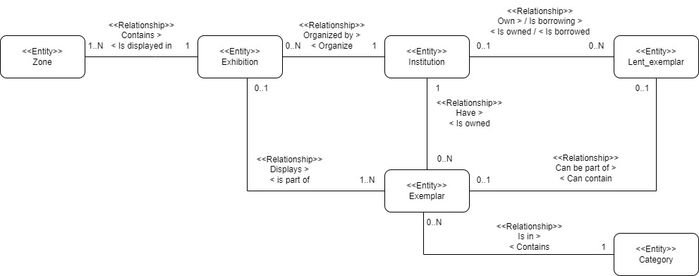
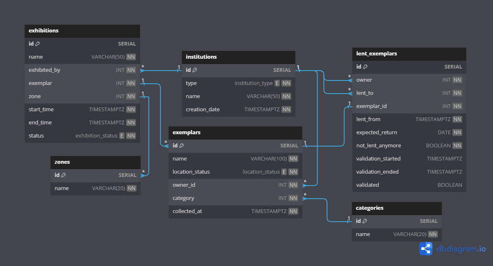

# Databázové systémy
## Zadanie č.4 - Návrh databázy múzea
###### Autor: Marek Čederle

### Konceptuálny model (ER diagram)



### Relačný dátový model (fyzický model)



### Popis tabuliek a vymenovaných typov (enum)
```sql
CREATE TYPE "location_status" AS ENUM (
  'on_way_to_owner',
  'on_way_to_borrower',
  'in_our_warehouse',
  'in_other_warehouse',
  'is_exhibited'
);

CREATE TYPE "institution_type" AS ENUM (
  'our_museum',
  'other_museum',
  'private_collector',
  'institution'
);

CREATE TYPE "exhibition_status" AS ENUM (
  'closed',
  'preparing',
  'ongoing'
);
```

##### Enum `location_status` (kde sa náš exemplár nenachádza)
- `on_way_to_owner` - exemplár je na ceste ku vlastníkovi
- `on_way_to_borrower` - exemplár je na ceste ku tomu čo si ho požičal
- `in_our_warehouse` - exemplár je v našom sklade
- `in_other_warehouse` - exemplár je v sklade inej inštitúcie
- `is_exhibited` - exemplár je súčasťou expozície (našej expozície pretože ostatné nás nezaujímajú)

##### Enum `institution_type` (typ inštitúcie)
- `our_museum` - iba pre naše múzeum
- `other_museum` - iné múzeá
- `private_collector` - súkromný zbierateľ
- `institution` - iné inštitúcie (okrem múzeí)

##### Enum `exhibition_status` (stav expozície)
- `closed` - expozícia je ukončená
- `preparing` - expozícia je v príprave
- `ongoing` - expozícia prebieha

Obmedzenia (constraints): všetky atribúty sú `not null` okrem `id` ale tie sú v podstate `not null` automaticky pretože sú `primary key`.
Výnimkou je `validation_started` a `validation_ended` a `validated` v tabuľke `lent_exemplars` pretože validácia sa spustí až keď sa exemplár vráti, dovtedy sú `null`.


##### Tabuľka `zones`
- `id` - identifikátor zóny
- `name` - názov zóny (unique, veľkosť stringu 20)

##### Tabuľka `categories`
- `id` - identifikátor kategórie
- `name` - názov kategórie (unique, veľkosť stringu 20)

##### Tabuľka `exhibitions`
- `id` - identifikátor expozície
- `name` - názov expozície (unique, veľkosť stringu 50)
- `exhibited_by` - inštitúcia, ktorá expozíciu organizuje (foreign key na `institutions`)
- `exemplar` - exemplár, ktorý je súčasťou expozície (foreign key na `exemplars`)
- `zone` - zóna, v ktorej sa expozícia nachádza (foreign key na `zones`)
- `start_date` - časový záznam začiatku expozície
- `end_date` - časový záznam konca expozície
- `status` - stav expozície (default: 'preparing', enum `exhibition_status`)

##### Tabuľka `institutions`
- `id` - identifikátor inštitúcie
- `type` - typ inštitúcie (enum `institution_type`)
- `name` - názov inštitúcie (unique, veľkosť stringu 50)
- `creation_date` - časový záznam pridania inštitúcie do databázy

##### Tabuľka `exemplars`
- `id` - identifikátor exempláru
- `name` - názov exempláru (unique, veľkosť stringu 100)
- `location_status` - stav exempláru (default: 'in_our_warehouse', enum `location_status`)
- `owner_id` - identifikátor vlastníka exempláru (foreign key na `institutions`)
- `category` - kategória exempláru (foreign key na `categories`)
- `collected_at` - časový záznam pridania exempláru do databázy

##### Tabuľka `lent_exemplars`
- `id` - identifikátor záznamu o požičanom exemplári
- `owner` - inštitúcia, ktorá je vlastníkom exempláru (foreign key na `institutions`)
- `lent_to` - inštitúcia, ktorá si exemplár požičala (foreign key na `institutions`)
- `exemplar_id` - id exemplára, ktorý je požičaný (foreign key na `exemplars`)
- `lent_from` - časový záznam požičania exempláru
- `expected_return` - dátum očakávaného vrátenia exempláru (stačí približný dátum)
- `not_lent_anymore` - boolean hodnota, ktorá hovorí či je exemplár už vrátený (je to v podstate atribút, ktorý identifikuje tombstone a reprezentuje vlastne históriu požičiavania)
- `validation_started` - časový záznam začiatku validácie exempláru
- `validation_ended` - časový záznam konca validácie exempláru
- `validated` - výsledok validácie exempláru

### SQL kód pre vytvorenie tabuliek databázy
Databázu vytvoríme cez GUI v pgAdmin4, pravým klikom na `Databases` -> `Create` -> `Database`. Zadáme meno `museum` a klikneme na `Save`. Následne vytvoríme tabuľky cez SQL kód.

```sql
-- Drop dependent tables first
DROP TABLE IF EXISTS lent_exemplars;
DROP TABLE IF EXISTS exhibitions;
DROP TABLE IF EXISTS exemplars;

DROP TABLE IF EXISTS categories CASCADE;

DROP TABLE IF EXISTS institutions;
DROP TABLE IF EXISTS zones;

-- Drop types
DROP TYPE IF EXISTS exhibition_status;
DROP TYPE IF EXISTS institution_type;
DROP TYPE IF EXISTS location_status;

CREATE TYPE "location_status" AS ENUM (
  'on_way_to_owner',
  'on_way_to_borrower',
  'in_our_warehouse',
  'in_other_warehouse',
  'is_exhibited'
);

CREATE TYPE "institution_type" AS ENUM (
  'our_museum',
  'other_museum',
  'private_collector',
  'institution'
);

CREATE TYPE "exhibition_status" AS ENUM (
  'closed',
  'preparing',
  'ongoing'
);

CREATE TABLE "institutions" (
  "id" SERIAL PRIMARY KEY,
  "type" institution_type NOT NULL,
  "name" VARCHAR(50) UNIQUE NOT NULL,
  "creation_date" TIMESTAMPTZ NOT NULL
);

CREATE TABLE "exemplars" (
  "id" SERIAL PRIMARY KEY,
  "name" VARCHAR(100) UNIQUE NOT NULL,
  "location_status" location_status DEFAULT 'in_our_warehouse' NOT NULL,
  "owner_id" INT NOT NULL,
  "category" INT NOT NULL,
  "collected_at" TIMESTAMPTZ NOT NULL
);

CREATE TABLE "lent_exemplars" (
  "id" SERIAL PRIMARY KEY,
  "owner" INT NOT NULL,
  "lent_to" INT NOT NULL,
  "exemplar_id" INT NOT NULL,
  "lent_from" TIMESTAMPTZ NOT NULL,
  "expected_return" DATE NOT NULL,
  "not_lent_anymore" BOOLEAN NOT NULL,
  "validation_started" TIMESTAMPTZ,
  "validation_ended" TIMESTAMPTZ,
  "validated" BOOLEAN
);

CREATE TABLE "categories" (
  "id" SERIAL PRIMARY KEY,
  "name" VARCHAR(20) UNIQUE NOT NULL
);

CREATE TABLE "exhibitions" (
  "id" SERIAL PRIMARY KEY,
  "name" VARCHAR(50) NOT NULL,
  "exhibited_by" INT NOT NULL,
  "exemplar" INT NOT NULL,
  "zone" INT NOT NULL,
  "start_time" TIMESTAMPTZ NOT NULL,
  "end_time" TIMESTAMPTZ NOT NULL,
  "status" exhibition_status DEFAULT 'preparing' NOT NULL
);

CREATE TABLE "zones" (
  "id" SERIAL PRIMARY KEY,
  "name" VARCHAR(20) UNIQUE NOT NULL
);

ALTER TABLE "lent_exemplars" ADD FOREIGN KEY ("owner") REFERENCES "institutions" ("id");
ALTER TABLE "lent_exemplars" ADD FOREIGN KEY ("lent_to") REFERENCES "institutions" ("id");
ALTER TABLE "lent_exemplars" ADD FOREIGN KEY ("exemplar_id") REFERENCES "exemplars" ("id");
ALTER TABLE "exemplars" ADD FOREIGN KEY ("owner_id") REFERENCES "institutions" ("id");
ALTER TABLE "exemplars" ADD FOREIGN KEY ("category") REFERENCES "categories" ("id");
ALTER TABLE "exhibitions" ADD FOREIGN KEY ("exhibited_by") REFERENCES "institutions" ("id");
ALTER TABLE "exhibitions" ADD FOREIGN KEY ("exemplar") REFERENCES "exemplars" ("id");
ALTER TABLE "exhibitions" ADD FOREIGN KEY ("zone") REFERENCES "zones" ("id");
```

### Opis základných procesov a vysvetlenie fungovania databázy

Naše múzeum je uložené ako jedna z inštitúcií. Ibo o našom múzeu však vedieme prehľad o organizovaných expozíciách. Bolo to takto vytvorené na zjednodušenie pracovania s požičiavaním exemplárov. Čo sa týka toho že ak je exemplár na ceste nemôže byť vystavený by sa riešlo asi na aplikačnej úrovni radšej ako na databázovej. Procesy kontroli som veľmi nepochopil ale implementoval som to tak, že ak sa nejaký exemplár požičia tak až v momente keď príde na dané miesto sa spustí kontrola a potom ak pracovníci reálne skontrolujú či prišiel v poriadku tak do databázi zapíšu dátum ukončenia kontroly a jeho výsledok. Dĺžku kontroly je možné zistit z časového záznamu začiatku a konca kontroly. Históriu expozícií evidujeme pomocou statusu expozície.

#### Naplánovanie expozície
Predpokladom je že máme v tabuľkách `institution` a `exemplar` uložené nejaké inštitúcie a exempláre. Taktiež v tabuľke `zones` máme uložené zóny, kde sa môžu expozície nachádzať a v tabuľke `categories` máme uložené kategórie, kam môžu exempláre patriť. Následne môžeme naplánovať expozíciu. Zadáme jej meno, kto ju organizuje, id exemplára ktorý je súčasťou expozície, id zóny kde sa expozícia nachádza, časový záznam začiatku a konca expozície. Stav expozície je defaultne nastavený na `preparing`, kedže ju plánujeme.

#### Vkladanie nového exempláru
Predpokladom je že máme v tabuľke `categories` uložené kategórie, kam môžu exempláre patriť a v tabuľke `institutions` uložené inštitúcie, ktoré môžu byť vlastníkmi exemplárov. Následne môžeme vložiť nový exemplár. Zadáme jeho názov, id vlastníka a id kategórie. Časový záznam pridania exempláru do databázy sa nastaví automaticky po pridaní. Stav kde sa nachádza sa nastaví na `in_our_warehouse` automaticky kedže ide predovšetkým o náše múzeum.

#### Presun exempláru do inej zóny
Ak pôjde o presun iba z jednej zóny do druhej tak aktualizujeme záznam. Ak pôjde o rozšírenie do ďalšej zóny tak vytvoríme nový záznam s novým id zóny a časovým záznamom pridania.

#### Prevzatie exempláru z inej inštitúcie (dostavame späť exemplár, ktorý sme požičali)
Ak mame v tabuľke `lent_exemplars` záznam o požičanom exemplári tak ak ku nam pride tak zmenime `location_status` exemplára na `in_our_warehouse`. Následne nastavíme `not_lent_anymore` na `true` a začneme validačný proces.

#### Zapožičanie exempláru z inej inštitúcie (požičiavame exemplár inej inštitúcii)
Ak chceme požičať exemplár tak vytvoríme nový záznam v tabuľke `lent_exemplars`. Zadáme id vlastníka exemplára, id inštitúcie, ktorá si ho požičala, id exemplára, časový záznam požičania, dátum očakávaného vrátenia a nastavíme `not_lent_anymore` na `false`.

### Poznámky
Na konci som si uvedomil chybu mojho návrhu. Mala byť ešte jedna tabuľka medzi expozíciami a exemplármi a taktiež medzi zónami a expozíciami.
