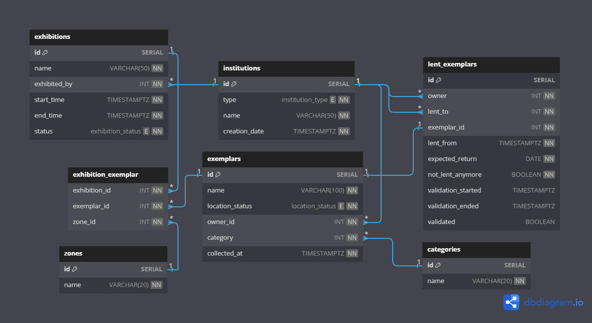

# Databázové systémy
## Zadanie č.5 - Implementácia procesov na dátovej úrovni (SQL)
###### Autor: Marek Čederle

### Zmeny v návrhu databázy oproti zadaniu č.4
- pridaná tabuľka `exhibition_exemplar` pre naplánovanie expozície
```sql
CREATE TABLE "exhibition_exemplar" (
  "exhibition_id" INT NOT NULL,
  "exemplar_id" INT NOT NULL,
  "zone_id" INT NOT NULL
);
```
- `lent_exemplars` ako entita by mala byť vymazaná z ER modelu
- pridaná default hodnota pre `collected_at` v tabuľke `exemplar` na aktuálny čas
```sql
CREATE TABLE "exemplars" (
  ...
  "collected_at" TIMESTAMPTZ NOT NULL DEFAULT CURRENT_TIMESTAMP
);
```
- vymazaný atribút `exemplar` z tabuľky `exhibitions` pretože mám na to tera tabuľku `exhibition_exemplar`
- opravený posledný proces `Zapožičanie exempláru z inej inštitúcie` pretože som si to asi zle prečítaľ keď som robil a definoval som to tam presne naopak

#### Relačný dátový model (fyzický model)


### Implementácia procesov na dátovej úrovni
- predpokladáme že používateľ zadáva výhradne korektné údaje pri volaní funkcií s tým, že ošetrované sú iba tie podmienky, kde zadá korektné údaje, ale aj tak mali by neželaný výsledok

#### Popis SQL súborov
- `DBS-2024-Zadanie5.sql` - vytvorenie tabuliek
- `proces1.sql` - implementácia procesu 1 (Naplánovanie expozície)
- `proces2.sql` - implementácia procesu 2 (Vkladanie nového exempláru)
- `proces3.sql` - implementácia procesu 3 (Presun exempláru do inej zóny)
- `proces4.sql` - implementácia procesu 4 (Prevzatie exempláru z inej inštitúcie)
- `proces5.sql` - implementácia procesu 5 (Zapožičanie exempláru z inej inštitúcie)
- `closed_trigger.sql` - obsahuje 2 triggery a 2 pomocné funkcie
- `ongoing_trigger.sql` - obsahuje 2 triggery a 2 pomocné funkcie
- `institutions_insert_trigger.sql` - obsahuje 1 trigger a 1 pomocnú funkciu
- `example-data.sql` - príkladové dáta pre testovanie procesov
- `all.sql` - všetky súbory spolu, chronologicky zoradené aby potom sa mohlo už priamo fungovať s databázou. Obsahuje vytvorenie tabuliek, implementáciu procesov a triggerov a nakoniec aj example data.

#### Vytvorenie tabuliek a ostatných súčastí databázy
Databázu vytvoríme cez GUI v pgAdmin4, pravým klikom na `Databases` -> `Create` -> `Database`. Zadáme meno `museum` a klikneme na `Save`. Následne vytvoríme všetko cez SQL kód zo súboru `all.sql`.

#### Proces č.1 - Naplánovanie expozície
Dovolujem rovnaký názov výstavy, ale nie v rovnakom čase, pretože možno chceme mať rovnakú výstavu raz za rok alebo niečo podobné. Ak je výstava v procese plánovania alebo prebieha nedovolím vytvoriť novú výstavu s rovnakým názvom. Inak vytvorím novú výstavu s danými údajmi. 
```sql
CREATE OR REPLACE PROCEDURE plan_exhibition(local_name VARCHAR(50), local_exhibited_by INT, local_start_time TIMESTAMPTZ, local_end_time TIMESTAMPTZ)
LANGUAGE plpgsql
AS $$
DECLARE
    local_status exhibition_status;
BEGIN
    -- allow to have the same name for the exhibition but not in the same time because maybe we want to have the same exhibition once a year or something like that

    -- select the status of the exhibition with the same name
    SELECT status INTO local_status FROM exhibitions WHERE name = local_name;

    -- check if the exhibition is already planned
    IF EXISTS (SELECT 1 FROM exhibitions WHERE name = local_name) AND local_status != 'closed'
    THEN
        RAISE EXCEPTION 'Exhibition with name % is already being displayed or it is preparing.', local_name;
    END IF;

    -- when in preparing state, there does not need to be exxemplar assigned, but it is in the phase of assigning the exemplar/s

    INSERT INTO exhibitions (name, exhibited_by, start_time, end_time)
    VALUES (local_name, local_exhibited_by, local_start_time, local_end_time);
END;
$$;
```
##### Príklad volania
Volanie s pozitívnym výsledkom.
```sql
CALL plan_exhibition('Testing', 1, NOW() + INTERVAL '1 month', NOW() + INTERVAL '5 month');
```

#### Proces č.2 - Vkladanie nového exempláru
Prvá procedúra prídá exemplár do našej kolekcie, to znamená že ak kúpime napríklad nejaký obraz, tak ho prídáme do našej databázy.

Druhá procedúra prídá exemplár do expozície. Zistíme si polohu nášho exemplára, ak sa nenachádza v našom sklade tak ho nepridáme pretože ho nemôžeme vystaviť. Ďalej zistíme stav expozície, ak je už uzavretá alebo prebieha tak nemôžeme pridať exemplár. Pridávať môžeme iba ak je v čase prípravy.
```sql
-- adding new exemplar to our collection
CREATE OR REPLACE PROCEDURE add_exemplar(local_name VARCHAR(100), local_owner_id INT, local_category INT)
LANGUAGE plpgsql
AS $$
BEGIN
    -- does not need to add the location status because it has default, the collected_at is set to current timestamp
    INSERT INTO exemplars (name, owner_id, category)
    VALUES (local_name, local_owner_id, local_category);
END;
$$;

--------------------------------------

-- adding new exemplar to exhibition
CREATE OR REPLACE PROCEDURE add_exemplar_to_exhibition(local_exhibition_id INT, local_exemplar_id INT, local_zone INT)
LANGUAGE plpgsql
AS $$
DECLARE
    local_location_status location_status;
    local_exhibition_status exhibition_status;
BEGIN
    -- select the location status of the exemplar
    SELECT location_status INTO local_location_status FROM exemplars WHERE id = local_exemplar_id;

    -- check if the exemplar is in our warehouse
    IF local_location_status != 'in_our_warehouse'
    THEN
        RAISE EXCEPTION 'Exemplar with id % is not in our warehouse, cannot be added to exhibition.', local_exemplar_id;
    END IF;

    -- select the status of the exhibition
    SELECT status INTO local_exhibition_status FROM exhibitions WHERE id = local_exhibition_id;

    -- check if the exhibition is already closed
    IF local_exhibition_status != 'preparing'
    THEN
        RAISE EXCEPTION 'Exhibition with id % is already closed or ongoing, cannot add exemplar.', local_exhibition_id;
    END IF;

    -- v jedenj zone a expozicii moze byt viacej exemplarov ale iba jedna expozicia, takze netreba osetrovat

    INSERT INTO exhibition_exemplar (exhibition_id, exemplar_id, zone_id)
    VALUES (local_exhibition_id, local_exemplar_id, local_zone);
END;
$$;
```
##### Príklad volania
Volania s pozitívnym výsledkom.
```sql
CALL add_exemplar('Dzabede Nesta', 1, 2);
CALL add_exemplar_to_exhibition(1, 6, 1);
```

#### Proces č.3 - Presun exempláru do inej zóny
Prvá procedúra zabezpečuje zmenu zóny pre exemplár v expozícii. Zistíme si stav expozície, ak nie je uzavretá a súčasne nájdeme že už bola priradená tak ju nemôžeme zmeniť, inak môžeme zmeniť zónu.

Druhá procedúra zabezpečuje pridanie novej zóny ku expozícii. Zistíme si stav expozície, ak nie je uzavretá a súčasne nájdeme že už bola priradená tak ju nemôžeme pridať, inak môžeme pridať novú zónu.

```sql
-- zone updating, changing the zone of the exemplar in the exhibition
CREATE OR REPLACE PROCEDURE update_exemplar_zone(local_exhibition_id INT, local_exemplar_id INT, local_updated_zone INT)
LANGUAGE plpgsql
AS $$
DECLARE
    local_status exhibition_status;
BEGIN

    -- select the status of the exhibition
    SELECT status INTO local_status FROM exhibitions WHERE id = local_exhibition_id;

    -- check if the zone is already assigned to another exhibition and if the exhibition is closed, then we can't update the zone, else we can update the zone
    IF EXISTS (SELECT 1 FROM exhibition_exemplar WHERE zone_id = local_updated_zone) AND local_status != 'closed'
    THEN
        RAISE EXCEPTION 'Zone with id % is already occupied', local_updated_zone;
    END IF;

    UPDATE exhibition_exemplar
    SET zone_id = local_updated_zone
    WHERE exhibition_id = local_exhibition_id AND exemplar_id = local_exemplar_id;
END;
$$;

--------------------------------------

-- zone extension, adding new zone to the exhibition
CREATE OR REPLACE PROCEDURE extend_zone(local_exhibition_id INT, local_exemplar_id INT, local_new_zone INT)
LANGUAGE plpgsql
AS $$
DECLARE
    local_status exhibition_status;
BEGIN
    -- select the status of the exhibition
    SELECT status INTO local_status FROM exhibitions WHERE id = local_exhibition_id;

    -- check if the zone is already assigned to another exhibition and if the exhibition is closed, then we can't extend the zone, else we can extend the zone
    IF EXISTS (SELECT 1 FROM exhibition_exemplar WHERE zone_id = local_new_zone) AND local_status != 'closed'
    THEN
        RAISE EXCEPTION 'Zone with id % is already occupied', local_new_zone;
    END IF;

    INSERT INTO exhibition_exemplar (exhibition_id, exemplar_id, zone_id)
    VALUES (local_exhibition_id, local_exemplar_id, local_new_zone);
END;
$$;
```

##### Príklad volania
Volania s pozitívnym výsledkom.
```sql
CALL update_exemplar_zone(1, 1, 5);
CALL extend_zone(1, 1, 7);
```

#### Proces č.4 - Prevzatie exempláru z inej inštitúcie (dostavame späť exemplár, ktorý sme požičali)
Nastavíme že exemplár je už v našom sklade a zároveň nastavíme že už nie je požičaný.
```sql
CREATE OR REPLACE PROCEDURE receive_lent_exemplar(local_exemplar_id INT)
LANGUAGE plpgsql
AS $$
BEGIN
    -- Update the location_status of the exemplar
    UPDATE exemplars
    SET location_status = 'in_our_warehouse'
    WHERE id = local_exemplar_id AND expected_return <= NOW();

    -- Update the not_lent_anymore flag of the lent_exemplar
    UPDATE lent_exemplars
    SET not_lent_anymore = TRUE, validation_started = NOW()
    WHERE exemplar_id = local_exemplar_id AND expected_return <= NOW();
END;
$$;
```

##### Príklad volania
Volania vyhodí error ak máme iba databázu zo začiatku a nijako sme ju neupravili, pretože exemplár síce existuje aj je požičaný ale ešte nemal byť vrátený.
```sql
CALL receive_lent_exemplar(5);
```

#### Proces č.5 - Zapožičanie exempláru z inej inštitúcie (~~požičiavame exemplár inej inštitúcii~~, oprava: Požičiavame si exemplár od inej inštitúcie)
Najskôr si zistíme ID nášho múzea, keďže mi budeme vlastníkom. Následne zistíme či je daný vlastník skutočným vlastníkom exemplára. Ak nie tak vyhodíme chybu. Inak pridáme nový záznam do tabuľky `lent_exemplars`.
```sql
CREATE OR REPLACE PROCEDURE borrow_exemplar(local_owner_id INT, local_exemplar_id INT, local_lent_from TIMESTAMPTZ, local_expected_return DATE)
LANGUAGE plpgsql
AS $$
DECLARE
    our_musem_id INT;
BEGIN
    -- select our museum id
    SELECT id INTO our_musem_id FROM institutions WHERE type = 'our_museum';

    -- check whether owner is real owner of the exemplar
    IF NOT EXISTS (SELECT 1 FROM exemplars WHERE id = local_exemplar_id AND owner_id = local_owner_id)
    THEN
        RAISE EXCEPTION 'Institution with id % is not the owner of the exemplar with id %.', local_owner_id, local_exemplar_id;
    END IF;

    INSERT INTO lent_exemplars (owner, lent_to, exemplar_id, lent_from, expected_return, not_lent_anymore)
    VALUES (local_owner_id, our_musem_id, local_exemplar_id, local_lent_from, local_expected_return, false);
END;
$$;
```

##### Príklad volania
Prvé volanie zlyhá pretože daná inštitúcia nie je vlastníkom exemplára.
Druhé volanie prebehne v poriadku.
```sql
CALL borrow_exemplar(2, 1, NOW(), CAST(NOW() + INTERVAL '1 month' AS DATE));
CALL borrow_exemplar(2, 7, NOW(), CAST(NOW() + INTERVAL '1 month' AS DATE));
```


### Implementované triggery a pomocné funkcie/procedúry

#### closed_trigger.sql
Prvý trigger zmení stav expozície na `closed` keď sa dosiahne koncový čas.

Druhý trigger zmení stav lokácie exemplárov z `is_exhibited` na `in_our_warehouse` keď sa expozícia uzavrie.
```sql
-- trigger for changing the exhibition status to closed when the end time is reached

CREATE OR REPLACE FUNCTION update_exhibition_status_closed() RETURNS TRIGGER AS $$
BEGIN
    UPDATE exhibitions
    SET status = 'closed'
    WHERE id = NEW.id AND end_time <= NOW();
    RETURN NEW;
END;
$$ LANGUAGE plpgsql;

CREATE TRIGGER exhibition_status_update_closed
BEFORE UPDATE ON exhibitions
FOR EACH ROW
EXECUTE FUNCTION update_exhibition_status_closed();

-- trigger for changing the location status of the exemplars when the exhibition is closed

CREATE OR REPLACE FUNCTION update_exemplar_status_in_our_warehouse() RETURNS TRIGGER AS $$
BEGIN
    IF NEW.status = 'closed' AND OLD.status = 'ongoing' THEN
        UPDATE exemplars SET location_status = 'in_our_warehouse'
        WHERE id IN (SELECT exemplar_id FROM exhibition_exemplar WHERE exhibition_id = NEW.id);
    END IF;
    RETURN NEW;
END;
$$ LANGUAGE plpgsql;

CREATE TRIGGER exemplar_status_update_in_our_warehouse
AFTER UPDATE OF status ON exhibitions
FOR EACH ROW
WHEN (OLD.status IS DISTINCT FROM NEW.status)
EXECUTE FUNCTION update_exemplar_status_in_our_warehouse();
```

#### ongoing_trigger.sql
Prvý trigger zmení stav expozície na `ongoing` keď sa dosiahne začiatočný čas.

Druhý trigger zmení stav lokácie exemplárov z `in_our_warehouse` na `is_exhibited` keď sa expozícia začne.
```sql
-- trigger that will change the exhibition status to ongoing when the start time is reached

CREATE OR REPLACE FUNCTION update_exhibition_status_ongoing()
RETURNS TRIGGER AS $$
BEGIN
    UPDATE exhibitions
    SET status = 'ongoing'
    WHERE id = NEW.id AND start_time <= NOW();
    RETURN NEW;
END;
$$ LANGUAGE plpgsql;

CREATE TRIGGER exhibition_status_update_ongoing
BEFORE UPDATE ON exhibitions
FOR EACH ROW EXECUTE FUNCTION update_exhibition_status_ongoing();

-- trigger that when the status of the exhibition changes to ongoing from preparing, all exemplars that belong to it will set the location status to is_exhibited

CREATE OR REPLACE FUNCTION update_exemplar_status_is_exhibited()
RETURNS TRIGGER AS $$
BEGIN
    IF NEW.status = 'ongoing' AND OLD.status = 'preparing' THEN
        UPDATE exemplars SET location_status = 'is_exhibited'
        WHERE id IN (
            SELECT exemplar_id FROM exhibition_exemplar WHERE exhibition_id = NEW.id);
    END IF;
    RETURN NEW;
END;
$$ LANGUAGE plpgsql;

CREATE TRIGGER exemplar_status_update_is_exhibited
AFTER UPDATE OF status ON exhibitions
FOR EACH ROW
WHEN (OLD.status IS DISTINCT FROM NEW.status)
EXECUTE FUNCTION update_exemplar_status_is_exhibited();
```

#### institutions_insert_trigger.sql
Tento trigger nám nedovolí pridať dalšiu inštitúciu, ktorá má typ `our_museum` keď už jedna existuje pretože máme iba jedno múzeum.
```sql
-- function and trigger for checking if there is already an institution of type 'our_museum'
-- because there can be only one institution of type 'our_museum'

CREATE OR REPLACE FUNCTION check_our_museum()
RETURNS TRIGGER AS $$
BEGIN
    IF NEW.type = 'our_museum' AND EXISTS (SELECT 1 FROM institutions WHERE type = 'our_museum') THEN
        RAISE EXCEPTION 'An institution of type "our_museum" already exists.';
    END IF;
    RETURN NEW;
END;
$$ LANGUAGE plpgsql;

CREATE OR REPLACE TRIGGER check_our_museum_trigger
BEFORE INSERT ON institutions
FOR EACH ROW
EXECUTE FUNCTION check_our_museum();
```